# EconMind — 진행 현황 및 향후 계획

> 이 문서는 **발표자료의 원본**이다. 각 절은 슬라이드 1~2장에 대응하도록 구성했고,
> 모든 수치에는 **어디서 확인했는지**를 붙였다. 발표 중 질문이 들어와도 근거를 바로 댈 수 있게 하기 위함이다.
>
> **기준일 2026-09-13** · 확인한 main 커밋: backend `e662389` · frontend `a347cca` · news-logic `2c62915` · deploy `5265009`

---

## 0. 이 문서를 읽는 법

| 파트 | 내용 | 발표 분량 |
|---|---|---|
| [1. 한눈에 보기](#1-한눈에-보기) | 프로젝트 정의와 현재 위치 | 1장 |
| [2. 지금까지 한 것](#2-지금까지-한-것) | 설계 → 구현 → 학기 이후 | 5~6장 |
| [3. 현재 상태 정밀 진단](#3-현재-상태-정밀-진단) | 문서와 코드의 차이 | 2장 |
| [4. 앞으로 할 것](#4-앞으로-할-것) | M2~M6 마일스톤 | 3~4장 |
| [5. 발표 구성 제안](#5-발표-구성-제안) | 슬라이드 매핑·예상 질문 | — |
| [6. 발표 전 반드시 고칠 것](#6-발표-전-반드시-고칠-것) | 수치 오기 등 | — |

용어: **M0~M6**은 마일스톤 번호다. M0는 6/9 최종 발표 시점의 MVP, M1 이후는 학기 이후 작업이다.

---

## 1. 한눈에 보기

### 1.1 한 줄 정의

> **실시간 뉴스를 수집·해석해 뉴스 간 관계(뉴스맵), AI 리포트, 투자 전략까지 연결하는 멀티 에이전트 투자 판단 지원 시스템.**

- **타깃**: 20~40대 다중자산 개인투자자 (뉴스 추적 시간 부족, 빠른 판단 필요, 전문 인프라 접근성 낮음)
- **화면 흐름**: `home → search → newsMap → detail → report → strategy`
- **철학**: 예측기가 아니다. 신뢰도·가정·근거·데이터갭을 명시하는 **의사결정 보조**다.

### 1.2 프로젝트는 3단계로 나뉜다

발표자료(주차보고 11건 + 최종보고서)는 ①②만 다룬다. **③은 Notion에만 있고, 이번 발표에서 처음 공개하는 부분이다.**

| 단계 | 기간 | 내용 | 상태 |
|---|---|---|---|
| ① 기획·설계 | W1~W10 (3~5월) | 주제 선정 → 기술 선정 → UX → API 명세 | 완료 |
| ② 발표 MVP | W11~최종 (6/9) | end-to-end 동작 + 성능 실측 | **완료 (M0)** |
| ③ 학기 이후 | 9/10~9/13 | Atlas 이탈 대응 → 자체 호스팅 → 브랜치 통합 | **진행 중** |

### 1.3 마일스톤 현황

| | 마일스톤 | 상태 | 막히는 지점 |
|---|---|---|---|
| **M0** | 발표 MVP | ✅ 완료 (2026-06-09) | — |
| **M1** | MongoDB 자체 호스팅 | ✅ **완료 (9/13 병합)** | — |
| **M2** | 브랜치 통합·정본화 | 🟡 **절반 완료 · 진행 중** | 다른 모든 것의 선행 조건 |
| **M3** | 설계 스키마 완성 | 🟡 일부 구현(미병합) | M2 |
| **M4** | 사용자·요금제 | 🟡 세션만 구현(미병합) | M2 |
| **M5** | 운영 안정화·보안 | 🔴 계획 문서만 작성 | M2 |
| **M6** | 범위 외 후속 | ⚪ 유보 | 학기 이후 |

---

## 2. 지금까지 한 것

### 2.1 전체 타임라인

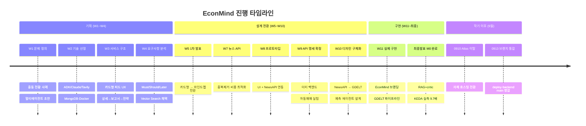

### 2.2 이 프로젝트의 핵심 — 네 번의 방향 전환

주차보고를 순서대로 읽으면 이 프로젝트의 가치는 **"과감하게 줄인 결정"**에 있다.
발표에서 가장 강조할 슬라이드다.

| 축 | 처음 (W1~W4) | 최종 | 전환 시점 | 왜 바꿨나 |
|---|---|---|---|---|
| **주제 범위** | LSTM/Transformer/FinGPT 정량 예측 | 멀티에이전트 MVP | W1 → W4 | 학기 내 end-to-end 안정화 우선. 정성 분석은 RAG·critic으로 보완 |
| **UI** | 카드뉴스/릴스형 피드 | **마인드맵** (중심=뉴스, 주변=연관) | W3 → W5 | 다중 자산 영향의 연관을 동시 시각화 |
| **뉴스 소스** | NewsAPI (영문 중심, 유료) | **GDELT DOC 2.0** + 본문추출 + NewsAPI 폴백 | W7 → W11 | 다국어·무료·전체 본문 → 요약 품질 향상 |
| **AI 신뢰성** | 단일 LLM 호출 | **RAG(top-3) + critic(LLM-as-judge)** | W10 → W11 | 환각 감소, 근거 제시, confidence 산출 |

추가 전환 4건:

| 축 | 변경 | 시점 |
|---|---|---|
| 그래프 센터 노드 | 키워드 → **사용자가 선택한 기사** | W10 |
| LLM 제공자 | Gemini 단일 → **Claude 우선 + Gemini 폴백** (임베딩은 Gemini 768d) | W8 → W11 |
| 프롬프트 출력 | 자유형 → **JSON 정형** | W9 → W11 |
| 전략 성향 | 공격적 자동매매 → **지표 기반 보수** (watch 포함) | W9 |

> **전략 성향 전환의 근거가 특히 좋다.** W9에 팀원이 Claude + 한국투자증권 API로 자동매매를 실험했는데,
> 공격적 매수 프롬프트로 실제 손실이 발생했다. 이후 PER·PBR·ROE 기반 보수적 조건으로 재설계했다.
> 결론: **"LLM 투자 에이전트는 모델 성능뿐 아니라 프롬프트의 리스크 정책 설계가 중요하다."**
> 이 실험은 캡스톤 코드와는 별개지만, 전략 모듈의 방향을 바꾼 근거로 발표 가치가 높다.

### 2.3 완성된 시스템 — 6계층 아키텍처

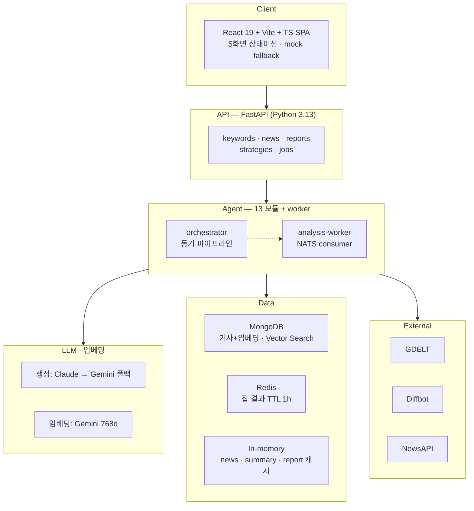

| 계층 | 구성 | 핵심 |
|---|---|---|
| Client | React 19 + Vite + TypeScript SPA | 5화면 상태머신, API 실패 시 정적 mock fallback |
| API | FastAPI (Python 3.13) | 5개 라우터 |
| Agents | 13 모듈 + worker | 동기 파이프라인 + NATS 비동기 잡 경로 |
| LLM·임베딩 | Claude 우선 / Gemini 폴백, Gemini 768d | Claude가 임베딩을 지원하지 않아 Gemini 채택 |
| Data | MongoDB + Redis + in-memory | Vector Search 인덱스, 잡 결과 TTL 1h |
| External | GDELT · Diffbot · NewsAPI · LLM API | 다국어 뉴스·본문·폴백 |

### 2.4 13 에이전트 파이프라인

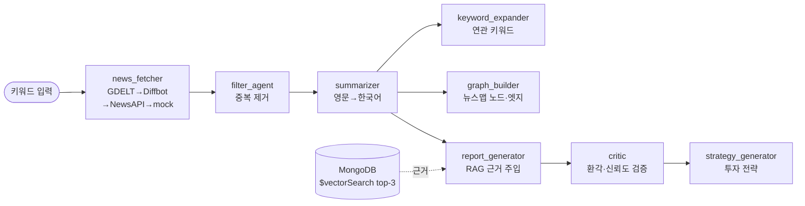

**에이전트 13종 — 실제 `app/agents/` 파일과 1:1 대응 (직접 확인)**

| 에이전트 | 역할 | 핵심 동작 | 상태 |
|---|---|---|---|
| `orchestrator` | 파이프라인 제어 | fetch → dedupe → summarize(상위 6) → expand | 활성 |
| `news_fetcher` | 수집 오케스트레이션 | GDELT → Diffbot → NewsAPI → mock 4단계 폴백 | 활성 |
| `gdelt_client` | GDELT DOC 2.0 수집 | URL 정규화 · 24h 캐시 · 12s 인터벌 · 429 선형백오프(최대 5회) | 활성 |
| `filter_agent` | 중복 필터 | 제목 토큰 overlap coefficient (LLM 미사용) | 활성 |
| `summarizer` | 영문→한국어 요약 | JSON 생성 · `summary_cache` · `asyncio.gather` | 활성 |
| `keyword_expander` | 연관 키워드 확장 | LLM 5~7개 (실패 시 빈도 fallback) | 활성 |
| `graph_builder` | 뉴스 마인드맵 | overlap → distance(0/1/2) · relevance_score | 활성 |
| `report_generator` | RAG 리포트 | Gemini 768d → `$vectorSearch` top-3 근거 주입 | 활성 |
| `critic` | LLM-as-judge 검증 | `grounded`·`confidence`·`unsupported_claims`·`invalid_tickers` | 활성 |
| `strategy_generator` | 투자 전략 | risk_level·period 기반 buy/hold/sell/watch | 활성 |
| `llm` | LLM·임베딩 추상화 | generate(Claude→Gemini) · embed(Gemini 768d) | 활성 |
| `diffbot_client` | Diffbot 본문 추출 | `cleaned_content` 추출 (실패 시 원본) | 제한적 (원문보기 전용) |
| `content_extractor` | DOM 점수 본문 추출 | BS4+lxml → 광고/댓글 제거 → trafilatura 폴백 | **구현 완료 · 미연동** |

> `content_extractor.py`(337줄)는 **어느 라우트에서도 호출되지 않는다.** `grep`으로 호출처 0건을 확인했다.
> W11 발표의 핵심 산출물이지만 파이프라인에는 Diffbot만 붙어 있다. 최종보고서 5.5절도 이를 명시한다.
> 발표에서 "구현했다"가 아니라 **"구현했고 연동이 남았다"**로 말해야 한다.

### 2.5 구현 규모 — 코드로 실측

```
capstone-backend    Python 3,667 LOC · 에이전트 13 · 라우터 5 · 엔드포인트 15 · 테스트 9
capstone-frontend   TS/CSS 2,842 LOC (App.tsx 705 · apiAdapter.ts 597 · styles.css 1,193 · mockData 327) · 테스트 0
capstone-news-logic 본문 추출기 4종 연구 (tavily · diffbot · jina · currents) + 본문검증 문서
capstone-deploy     compose 7서비스 · k8s 매니페스트 7(KEDA ScaledObject 포함) · mongo-init 4 · 운영 스크립트 4 · 부하도구
```

백엔드 주요 파일 상위 10개 (LOC):

| 파일 | 줄 수 | 역할 |
|---|---:|---|
| `app/database.py` | 386 | MongoDB 접근·인덱스·벡터 인덱스 |
| `app/agents/content_extractor.py` | 337 | DOM 점수 본문 추출 (**미연동**) |
| `app/api/v1/news.py` | 322 | 검색·그래프·관계·원문 |
| `app/agents/diffbot_client.py` | 263 | Diffbot 연동 |
| `app/agents/gdelt_client.py` | 258 | GDELT DOC 2.0 클라이언트 |
| `app/agents/news_fetcher.py` | 228 | 4단계 폴백 수집 |
| `tests/test_smoke.py` | 205 | 통합 테스트 9건 |
| `app/schemas.py` | 192 | Pydantic 스키마 |
| `app/agents/report_generator.py` | 127 | RAG 리포트 |
| `app/agents/strategy_generator.py` | 119 | 투자 전략 |

### 2.6 API 표면 — 실제 라우팅 (코드 기준)

| Method | 실제 경로 | 기능 |
|---|---|---|
| GET | `/health` | 서버 상태 (`mongodb: on/off`) |
| GET | `/api/v1/keywords/recommended` | 추천 키워드 |
| GET | `/api/v1/news/search` | 검색 |
| GET | `/api/v1/news/cards` | 카드 목록 |
| GET | `/api/v1/news/{id}/thumbnail` | 썸네일 |
| GET | `/api/v1/news/{id}/source` | 원문 (미보유 시 Diffbot 온디맨드) |
| GET | `/api/v1/news/{id}/graph` | 마인드맵 (center·nodes·edges) |
| GET | `/api/v1/news/{id}/related` | 연관 뉴스 |
| GET | `/api/v1/news/{id}/relations` | 연관도 수치 (PAID) |
| POST | `/api/v1/news/selections` | 뉴스 다중 선택 (PAID) |
| POST/GET | `/api/v1/reports`, `/api/v1/reports/{id}` | AI 리포트 |
| POST/GET | `/api/v1/strategies`, `/api/v1/strategies/{id}` | 투자 전략 |
| POST/GET | **`/jobs`**, **`/jobs/{id}`** | 비동기 분석 (NATS→worker→Redis) |
| POST | `/analyze` | 레거시 (프론트 backward compat) |

> **W9 API 명세와 다른 점 2가지** — 발표자료의 명세표를 그대로 쓰면 틀린다.
> - `/health`는 `/api/v1/health`가 아니라 **루트**에 있다.
> - `/jobs`도 `/api/v1` 아래가 아니라 **루트**에 있다 (`app/main.py`에서 `api_v1`과 별도로 등록).

### 2.7 성능 실측 — 이 프로젝트의 가장 단단한 근거

`capstone-deploy/MEASUREMENTS.md` 실측값이다.

**(A) Docker Compose — worker 수를 직접 바꿔 측정 (50건 동시 burst)**

| 지표 | 1 worker | 10 workers | 개선 |
|---|---|---|---|
| 총 드레인 시간 | **100.9s** | **10.4s** | **9.7× (−90%)** |
| p95 응답 지연 | 94.8s | 10.4s | **−89%** |
| p50 응답 지연 | 52.4s | 6.3s | −88% |
| 처리량 | 30 jobs/min | 290 jobs/min | **9.7×** |

이론 검증: 직렬 1 worker = 50건 × 2s ≈ 100s → 실측 100.9s로 일치.
병렬 10 worker = (50/10) × 2s + 램프 ≈ 10s → 실측 10.4s.

**(B) kind + KEDA — 사람 개입 없이 자동 확장 (n=60 burst)**

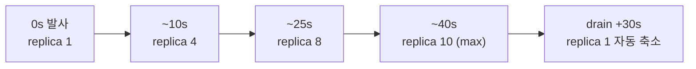

- KEDA `nats-jetstream` 트리거가 consumer lag을 감지해 자동 확장
- n=60 드레인 30.6s / n=80 드레인 38.8s (124 jobs/min)
- Prometheus `kube_deployment_status_replicas` 수집 곡선: `1→10→1→5→1` → Grafana 시각화

**(C) 측정의 한계 — 발표에서 먼저 말해야 할 부분**

- `demo_mode` 고정 2s/job 기준. **실제 LLM 지연은 반영되지 않았다.**
- 단일 노드(kind), 단일 시나리오, 단발 측정. 부하 곡선 다양화·장기 안정성 측정은 미수행.
- 본문 추출 품질 비교(Diffbot ≈ Tavily > Jina)는 **정성 순위**다. 정답셋 기반 점수는 미시행.

> 한계를 먼저 밝히면 "그럼 실제로는요?"라는 질문을 선점할 수 있다. 최종보고서도 이 방식을 택했다.

### 2.8 학기 이후 — 발표자료에 없는 부분 (9월)

#### 9/10 — MongoDB Atlas 무료 클러스터가 미사용으로 삭제됨

예정된 작업이 아니라 **사고 대응**이었다. 이관할 데이터 없이 자체 호스팅으로 새로 시작했다.

| 항목 | 내용 |
|---|---|
| 이미지 선택 | `mongodb/mongodb-atlas-local:8.0.28` (mongod + mongot) → **`$vectorSearch`가 앱 코드 수정 없이 동작** |
| 대안 비교 | B안 `mongo:7` + numpy 코사인 → 폴백 조건 미해당 / C안 별도 벡터 DB(Qdrant) → 구성요소 증가로 제외 |
| 스키마 | 8개 컬렉션 + JSON Schema validator + 인덱스 34개 + 벡터 인덱스 |
| 접속 | compose 네트워크 내부 `mongodb:27017`만. 호스트 포트 미노출. root(운영) / 앱 전용(`readWrite@capstone_news`) 계정 분리 |
| 영속화 | named volume 3개 — `/data/db`, `/data/configdb`, `/data/mongot` |

**백엔드 정합화 3건** — validator가 전부 거부하던 원인:

1. 앱이 옛 이름 `articles`에 씀 → `NEWS` 상수로 교체, 설계 외 컬렉션 drop
2. 날짜가 문자열 → `_parse_dt()`로 BSON date 변환 (GDELT 원형 `20260604T010203Z` 포함)
3. `source`가 문자열 → url에서 domain을 뽑아 `{name, domain}` 객체로

**읽기 경로 연결** — MongoDB가 write-only여서 API 재시작·scale 시 데이터가 있어도 404가 나던 문제.
`app/store.py`에 L1(메모리) → L2(Mongo) 접근자를 두고 호출부 12곳 교체.
같이 잡은 버그: Mongo 경로에서 `published_at`의 `Z`가 빠져 프론트에서 9시간 밀리던 것 → `_iso_z()`로 통일.

**메모리 실측 (RAM 7.7GB 서버)**

| 컨테이너 | 상한 | 실측 |
|---|---|---|
| mongodb (mongod + mongot) | 3.0 GB | 606 → 804 MiB |
| econmind-api | 768 MB | 66.8 MiB |
| econmind-worker × 1 | 512 MB | 37.1 MiB |
| nats / redis / frontend | 각 128 MB | 18.5 / 5.0 / 20.0 MiB |
| **호스트 여유** | — | **5.1 GB** |

OOMKilled 없음, 2시간 10분 무재시작. WiredTiger 캐시는 cgroup 상한을 읽어 자동 1024MB.

> ⚠️ **운영 주의 2건**
> - 이 이미지는 `command:` 덮어쓰기나 `--wiredTigerCacheSizeGB` 플래그를 쓰면 **mongot이 뜨지 않아 벡터 검색이 죽는다.**
> - burst 부하 실험(worker 최대 10개)은 반드시 `docker-compose.burst.yaml` 오버레이와 함께 실행한다. 기본 상한 그대로면 8GB 서버에서 OOM.

#### 9/13 — 브랜치 통합 착수

| 시각 (KST) | 사건 |
|---|---|
| 17:03~17:06 | `codex/automatic-deployment`를 backend·frontend·news-logic·deploy에 병합 |
| 18:05 | **4개 레포 모두 revert** (사유 미기록) |
| 18:57 | `codex/capstone-directory-deploy` → deploy main (`compose.server.yaml`·`Caddyfile`) |
| **21:45** | **`fix/align-news-schema` → backend main** ✅ |
| **22:16** | **`feat/mongodb-self-hosted` → deploy main** ✅ |

### 2.9 현재 화면 — 실제 구동 캡처 (2026-09-14)

아래는 **`main` 체크아웃 그대로 띄워서 직접 캡처**한 화면이다. 발표자료의 화면 이미지는 6월 시점이므로,
현재 코드가 실제로 무엇을 보여주는지는 이쪽이 정확하다.

> 구동 조건: `USE_MOCK_NEWS=true` · `USE_LLM_SUMMARIES=false` · `USE_RAG=false` · `USE_CRITIC=false` · `USE_MONGODB=false`
> (외부 API 키 없이 구동). 뉴스 데이터는 한국어 mock 픽스처, 썸네일은 외부 이미지 대신 로컬 플레이스홀더.

| 화면 | 캡처 |
|---|---|
| **1. 홈 · 검색** — 검색창 + 추천 키워드 8종 (백엔드 API 응답) | 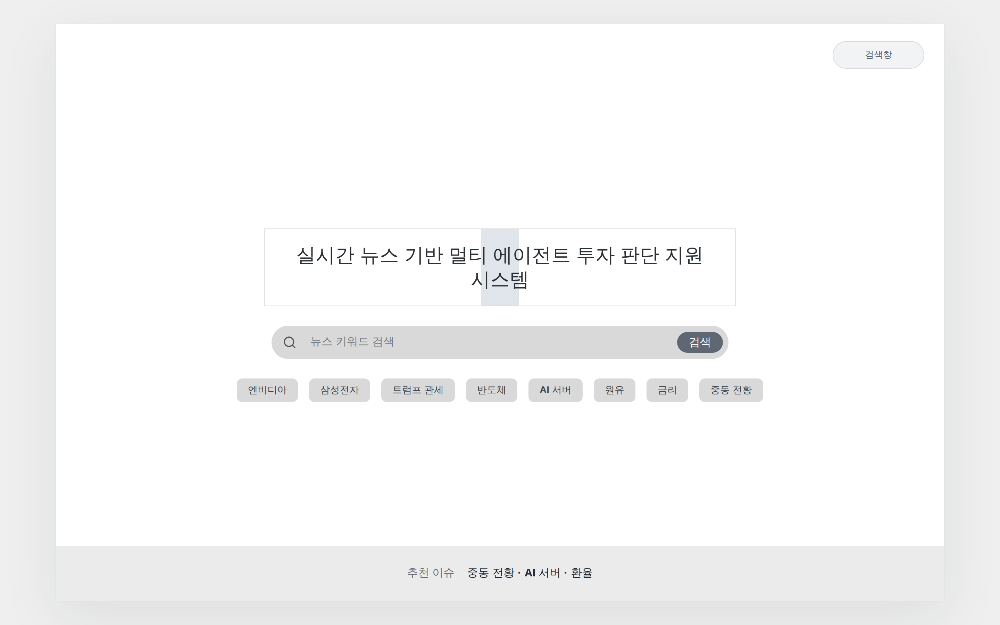 |
| **2. 검색 결과** — 키워드 클러스터 (중심 키워드 + 연관 키워드 궤도 배치) | 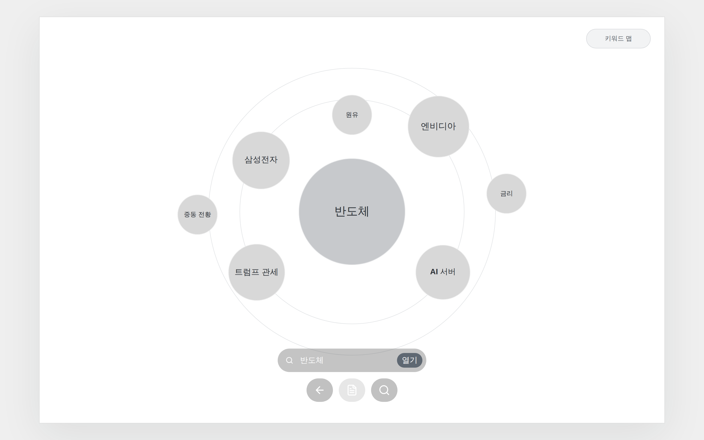 |
| **3. 뉴스맵** — 중심 뉴스 + 연관 뉴스 노드·엣지, 우측 유료 프리뷰 | 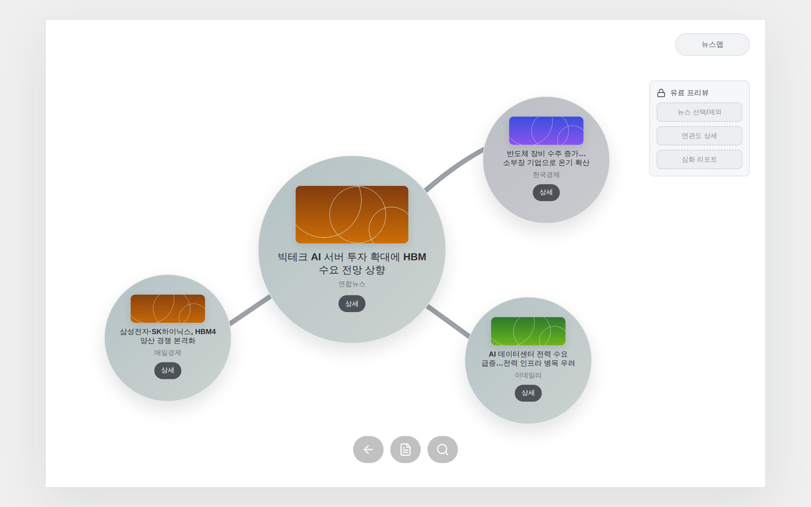 |
| **4. 뉴스 상세** — 좌측 미니맵 + 우측 기사 상세·원문 링크·리포트 진입 | 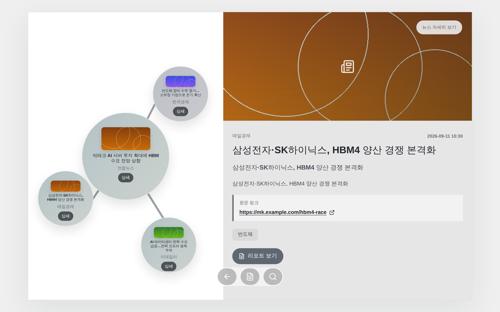 |
| **5. AI 리포트** — 사건 요약·시장 영향·종목 카드(KRX 티커)·분할 관심 | 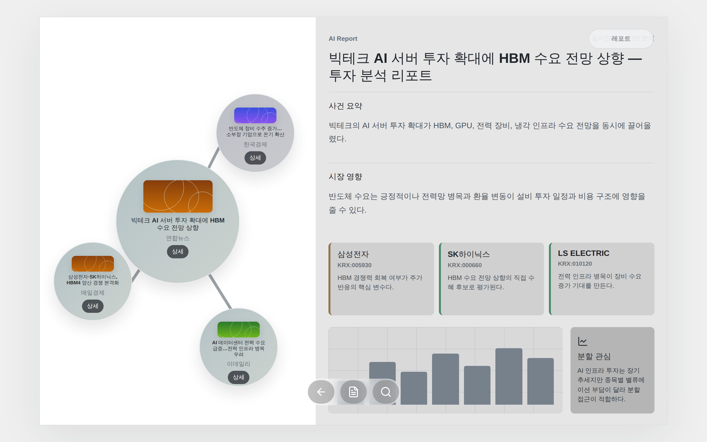 |
| **6. 모바일 홈** (390×844) | 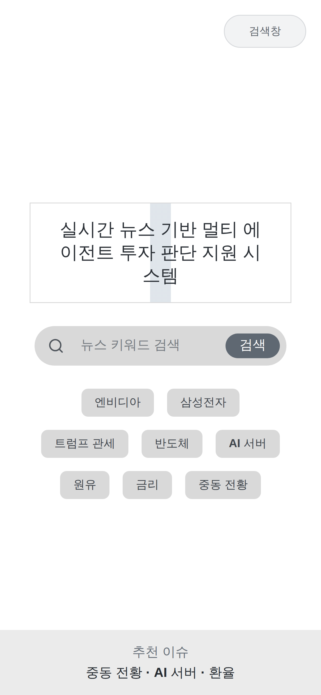 |
| **7. 모바일 키워드 맵** | 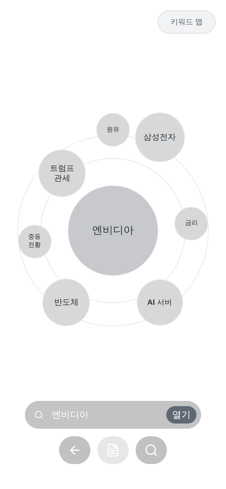 |

**캡처에서 확인된 것**

- `home → searchResults → newsMap → newsDetail → report` 5화면 흐름이 **키 없이도 끝까지 동작한다.**
  발표에서 "폴백 설계로 외부 의존 없이 시연 가능"을 말할 때 이 캡처가 근거다.
- AI 리포트 화면은 LLM 키가 없으면 **프론트 mock 리포트로 폴백**한다. 종목 카드(삼성전자·SK하이닉스·LS ELECTRIC)와
  KRX 티커가 보이는 건 폴백 데이터이며, **실시간 시세 연동은 아니다** (6.6 미구현 항목).
- 뉴스맵 엣지는 그려지지만 **연관도 수치는 표시되지 않는다** — 「연동 중」으로 기록된 그대로다.
- 유료 프리뷰 패널(뉴스 선택/제외 · 연관도 상세 · 심화 리포트)은 **버튼이 disabled 상태**다. 권한 게이팅 미구현과 일치한다.


---

## 3. 현재 상태 정밀 진단

### 3.1 저장소·브랜치 실상태 (2026-09-13 기준)

| 저장소 | main 상태 | 미병합 브랜치 |
|---|---|---|
| `capstone-backend` | 9월 정합화 반영됨 (`e662389`) | `claude/…q7z7c9` (+3 커밋) |
| `capstone-frontend` | 6월 발표 상태 (`a347cca`) | `claude/…q7z7c9` (+1 커밋) |
| `capstone-news-logic` | 추출기 5종 연구 (변동 없음) | `jina` · `md` · `diffbot` (5월 실험 브랜치) |
| `capstone-deploy` | MongoDB 자체 호스팅 반영됨 (`5265009`) | `claude/…q7z7c9` (+4 커밋) |

### 3.2 문서와 실제가 어긋난 지점 ⚠️

Notion 「마일스톤·로드맵」은 **M1을 "미병합", M2를 "🔴 최우선·미착수"**로 기록하고 있다.
하지만 **그 문서가 작성된 직후(22:00 KST) 두 건이 실제로 병합됐다.**

| 브랜치 | 문서 기록 | 실제 (git 확인) |
|---|---|---|
| `capstone-deploy#feat/mongodb-self-hosted` | main 미병합 | ✅ **9/13 22:16 병합** (`5265009`) |
| `capstone-backend#fix/align-news-schema` | main 미병합 | ✅ **9/13 21:45 병합** (`e662389`, diff 0) |
| `claude/…q7z7c9` (3개 레포) | main 미병합 | ⬜ 여전히 미병합 |

**따라서 현재 정확한 상태는:**

- **M1은 완료.** 위키의 *"main을 받아 띄우면 Atlas를 찾다 죽는다"*는 경고는 **해소됐다.**
  `capstone-deploy/main`에 `mongo-init/` 4개 스크립트와 mongodb 서비스가 들어와 있음을 확인했다.
- **M2는 절반 완료.** `claude/…q7z7c9` 3개 레포만 남았다.

### 3.3 컬렉션별 채워짐 상태 — 설계 8개 중 실제로 쓰이는 것

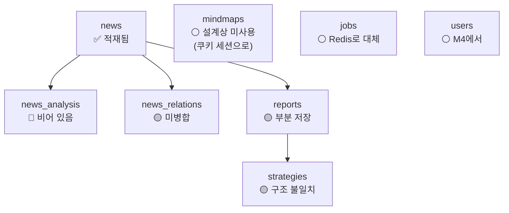

| 컬렉션 | 상태 | 남은 일 | 담당 |
|---|---|---|---|
| `news` | ✅ 적재됨 | `keywords`·`categories`·`related_tickers`가 **전부 빈 배열** | 문주안·김성민 |
| `news_relations` | 🟡 구현됨(미병합) | `same_topic`만 판별. 설계 6종 중 나머지 5종 | 김성민 |
| `reports` | 🟡 저장됨 | `sections` 7개 중 2개만 · `scores`·`model_info` 없음 · validator가 warn | 김성민 |
| `strategies` | 🟡 저장됨 | 설계는 백테스트 구조, 구현은 추천 목록 — **구조 자체가 다름** | 김성민 |
| `news_analysis` | 🔴 비어 있음 | 뉴스 단위 분석 파이프라인 자체가 없음 | 김성민 |
| `mindmaps` | ⚪ 설계상 미사용 | 12주차 결정대로 세션으로 처리 (M4) | — |
| `jobs` | ⚪ Redis로 대체 | Mongo로 옮길지 결정 필요 | 미정 |
| `users` | ⚪ 비어 있음 | M4에서 | — |

### 3.4 설계-구현 불일치 목록 (발표 시 정직하게 밝힐 것)

| # | 항목 | 설계/문서 | 실제 코드 |
|---|---|---|---|
| 1 | `content_extractor` | W11 핵심 산출물 | **호출처 0건 — 데드코드.** Diffbot만 연결 |
| 2 | `/health`, `/jobs` 경로 | `/api/v1/...` | **루트**에 등록 |
| 3 | `/health`의 `mongodb` 값 | 실제 연결 상태 | `database.enabled()` — **설정 여부만** 반환. 실제 ping 아님 |
| 4 | 4컬렉션 정규화 | 최종보고서 "구현" | 실제는 `articles` 중심 경량 모델 → 9월에야 `news`로 정합화 |
| 5 | tier 권한 | FREE/BASIC/PAID | **쿼리파라미터 `tier=` 게이팅만.** JWT·세션 미적용 |
| 6 | CI | — | **4개 레포 전부 `.github/` 없음.** 프론트 테스트 0건 |
| 7 | `compose.server.yaml` | 서버 운영 | `USE_MOCK_NEWS=true`, `USE_MONGODB=false`, `USE_RAG=false` — **mock 기본값** |

> **#7이 특히 중요하다.** 서버용 compose의 healthcheck는 `mongodb == 'off'`를 **통과 조건**으로 걸고 있다.
> 즉 현재 서버는 **mock 모드로 뜨는 것이 정상 판정**이다.
> **"서버 기동 성공"과 "실데이터 운영 중"은 다른 상태다.** M2 이후 이 플래그와 healthcheck 기대값을 함께 바꿔야 한다.

---

## 4. 앞으로 할 것

### 4.1 권장 순서

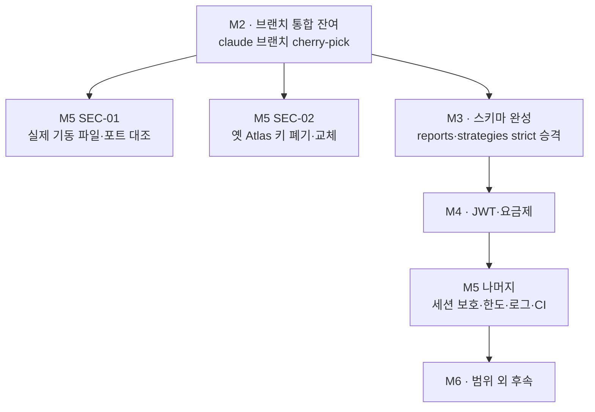

### 4.2 M2 — 브랜치 통합 잔여 🔴 최우선

**`claude/…q7z7c9`에만 있는 것:**

| 대상 | 내용 | 규모 |
|---|---|---|
| backend | `session.py`(쿠키 세션) · `sessions.py` API · `news_relations` 저장 · 마인드맵 확장 · `seed_mongo.py` | **+1,322줄** (테스트 9 → 24) |
| frontend | `credentials: 'include'` — 없으면 세션 쿠키가 안 실려 사용자별 마인드맵이 아예 동작 안 함 | +34줄 |
| deploy | **폐기 대상** | −1,535줄 (퇴행) |

#### ⚠️ 리스크 2건 — 그냥 머지하면 안 된다

**1. 이 브랜치는 6/9(`e56b15e`) 기준이다.**
9월 정합화 커밋 2건(`cb927b6`, `479109f`)을 모르는 상태라 `database.py`가 388줄 갈아엎는 형태(−341)로 잡힌다.
**그대로 머지하면 오늘 병합한 `fix/align-news-schema`를 되돌린다.** → **파일 단위 cherry-pick 필수.**

**2. deploy 쪽 변경은 명백한 퇴행이다.**

| 항목 | `feat/mongodb-self-hosted` (현 main) | `claude/…q7z7c9` |
|---|---|---|
| 볼륨 | `/data/db` · `/data/configdb` · **`/data/mongot`** | `/data/db`만 → **재기동마다 벡터 인덱스 재빌드** |
| 헬스체크 | 이미지 내장 `runner healthcheck` (mongot까지 확인) | `mongosh ping` (mongod만) |
| 태그 | `8.0.28` 고정 | `8.0` |
| burst | 전용 오버레이 파일 | "mongodb를 내려라" 안내만 |
| 기타 | `scripts/` 4종 · `04-vector-index.js` 존재 | 삭제됨 |

→ **deploy의 claude 브랜치 변경은 전부 버린다.**

#### M2 포팅 체크리스트

- [ ] `app/session.py` 신규 추가 (187줄)
- [ ] `app/api/v1/sessions.py` 신규 추가 (72줄)
- [ ] `app/main.py` — **세션 미들웨어 + `allow_credentials=True`** ⚠️ 현 main은 `allow_credentials=False`라 이것 없이는 쿠키가 아예 동작하지 않는다
- [ ] `app/config.py` — `session_ttl_seconds`, `session_cookie_samesite`, `session_cookie_secure`
- [ ] `app/api/v1/news.py` — `news_relations` 저장 + 마인드맵 확장 부분만 (정합화 코드는 건드리지 않기)
- [ ] `tests/test_smoke.py` — 테스트 9 → 24 반영
- [ ] `scripts/seed_mongo.py`
- [ ] frontend `apiAdapter.ts` — `credentials: 'include'` + `SessionState` 타입
- [ ] deploy의 claude 브랜치 변경은 **폐기**
- [ ] 환경변수 `MONGO_*` → **`MONGODB_*`로 통일** (백엔드 `config.py` 포함)
- [ ] `codex/automatic-deployment` revert 사유 기록 → 재시도할지 폐기할지 결정
- [ ] `capstone-news-logic`의 `jina`·`md`·`diffbot` 브랜치 정리 (5월 실험 브랜치)

**완료 기준**: 미병합 브랜치 0개 · `main` 체크아웃만으로 스택 기동 · `pytest` 통과 · **두 세션이 서로 다른 마인드맵을 본다**

**담당**: 김건(deploy) · 김성민(backend) · 문주안(frontend)

### 4.3 M3 — 설계 스키마 완성 🟡

| 우선 | 할 일 | 담당 |
|---|---|---|
| P1 | `news_relations` 저장 구현 (M2에서 포팅) · `relation.type` 6종 중 `same_topic` 외 확장 | 김성민 |
| P1 | `reports`·`strategies` 문서를 설계 형태로 → `scripts/strict-validation.js`로 error 승격 | 김성민 |
| P2 | `keywords`·`categories` 추출기 (지금 빈 배열) | 문주안 |
| P2 | `related_tickers` 종목 연관 추출 (지금 빈 배열) | 김성민 |
| P2 | `capstone-backend/.env.example` 생성 (deploy 쪽에만 있음) | 문주안 |
| P3 | `jobs`를 Redis에 둘지 Mongo로 옮길지 결정 | 미정 |

**완료 기준**: `strict-validation.js`로 reports·strategies validator를 warn → error 승격해도 **거부 로그 0건**

> `strategies`는 단순 필드 추가가 아니라 **구조 재설계**다. 설계는 백테스트 가능한 객체(`logic`·`parameters`·`backtest`)인데 구현은 추천 목록이다.
> 백테스트를 M6로 미룬다면 **설계 문서 쪽을 현실에 맞춰 내리는 것도 방법**이다.

### 4.4 M4 — 사용자·요금제 🟡

| 단계 | 상태 |
|---|---|
| 세션(쿠키) 식별 — `econmind_sid`, Redis TTL | 🟡 구현됨(미병합) |
| 사용자별 마인드맵 + 확장 기능 | 🟡 구현됨(미병합) |
| JWT 로그인 → `users` 컬렉션 활성화 | 🔴 미착수 |
| FREE·BASIC·PAID 권한 게이팅 (지금은 쿼리파라미터) | 🔴 미착수 |
| 유료 흐림 처리·결제 UI | 🔴 설계 단계 |

> 12주차 회의 결정(*"mindmaps는 DB에 저장하지 않는다 — 로그인이 없어 사용자를 식별할 수 없으므로 쿠키로"*)이
> `econmind_sid` + Redis TTL로 정확히 구현돼 있다. **만료 = 세션 소멸 = 마인드맵 삭제**로 설계가 그대로 지켜진다.
> 설계 결정 → 구현 추적성이 좋은 사례라 발표에 쓸 만하다.

> ⚠️ HTTPS로 서비스하면 `SESSION_COOKIE_SECURE=true`가 필요하고, 프론트와 API가 다른 도메인이면 `SAMESITE=none`까지 필요하다.

### 4.5 M5 — 운영 안정화·보안 🔴

김성민이 작성한 **SEC-01 ~ SEC-10 계획 문서**가 있다. 현재는 **설계 초안이며 조치 완료가 아니다.**

| 우선 | 항목 | 확인한 사실 |
|---|---|---|
| **P0** | 내부 포트 차단 | **`docker-compose.yaml`이 NATS 4222·8222, Redis 6379를 호스트에 게시.** 무인증. 단 `compose.server.yaml`(서버용)은 게시하지 않음 → **실제 서버가 어느 파일로 떴는지 확인이 먼저** |
| **P0** | 옛 Atlas 계정 폐기 | Notion 페이지 이력과 로컬 `dumi_data_mongo.ipynb`에 평문으로 남아 있음. **문자열 삭제가 아니라 제공자에서 폐기·교체** |
| P1 | HTTPS·세션·CORS·CSRF | 쿠키에 Secure·HttpOnly·SameSite. 서버가 발급한 SID만 인정 |
| P1 | 서버 기준 권한·소유권 | `tier=PAID`를 권한 근거로 쓰지 않기. 타인 리소스 ID를 알아도 못 읽게 |
| P1 | 요청·큐·외부 API 한도 | 초안: 본문 32 KiB, 검색어 100자, 관련 ID 20개, 세션당 동시 작업 1개 |
| P1 | 오류·로그·준비 상태 | 생존 확인과 실제 연결 확인(readiness) 분리. **현재 `/health`는 설정값만 반환** |
| P1/P2 | CI 검사 | **4개 레포 전부 `.github/` 없음.** Gitleaks·pip-audit·npm audit·Trivy |
| 중간 | k8s 매니페스트 | `k8s/backend-api.yaml`이 아직 Atlas `MONGODB_URI` 전제 |
| 낮음 | GHCR 이미지 · Grafana 대시보드 · VM+k3s 이관 | |

> 이 계획서의 완료 기준 정의가 좋다:
> **"완료는 설정 변경 여부가 아니라 외부 차단·권한 우회 거부·장애 복구의 *증거*로 판단한다."**
> 발표에서 그대로 인용할 만한 문장이다.

### 4.6 M6 — 범위 외 후속 ⚪

최종보고서 6.6이 "범위 제외"로 명시한 항목들. 학기 내 end-to-end 안정화를 우선한 결정의 결과다.

- `content_extractor.py` 파이프라인 연동 (337줄, 현재 데드코드)
- 백테스트 가능한 전략 객체 (`logic`·`parameters`·`backtest`)
- 실시간 KRX 시세·티커 매핑·등락 배지 — **필드는 존재, 연동 미적용**
- 정량 딥러닝 (LSTM·Transformer·FinGPT) — W1~W2 구상안
- Google ADK 전환 — `pyproject.toml`에 *"google-adk is intentionally deferred — current orchestrator is a deterministic pipeline"*로 **의도적 유보 명시**
- 미래 예측 에이전트 (W10에서 XML 입력·JSON 출력·신뢰도/가정/갭 명시까지 **설계 완료**, 파이프라인 미반영)
- 멀티노드 HA
- 뉴스맵 SVG 동적화 · 엣지 연관도 수치 표시

---

## 5. 발표 구성 제안

### 5.1 슬라이드 매핑 (10분 기준)

| # | 슬라이드 | 이 문서의 절 | 핵심 메시지 | 시간 |
|---|---|---|---|---|
| 1 | 표지 | — | EconMind · 팀 | 10s |
| 2 | 한 줄 정의 + 화면 흐름 | 1.1 | "예측기가 아니라 의사결정 보조" | 40s |
| 3 | **네 번의 방향 전환** | 2.2 | **"무엇을 버렸는가"가 이 프로젝트의 핵심** | 90s |
| 4 | 6계층 아키텍처 | 2.3 | 계층 분리 | 60s |
| 5 | 13 에이전트 파이프라인 | 2.4 | 역할 분업 + RAG·critic | 80s |
| 6 | **성능 실측 (KEDA 자동확장)** | 2.7 | **9.7배 · 사람 개입 없음** | 90s |
| 7 | 학기 이후 — Atlas 이탈 대응 | 2.8 | **사고 대응으로 얻은 자체 호스팅** | 80s |
| 8 | 현재 상태 진단 | 3.2~3.4 | 정직한 구현/미구현 구분 | 70s |
| 9 | 앞으로 — M2~M5 | 4.1~4.5 | 우선순위와 담당 | 80s |
| 10 | 마무리 | — | 배운 점 3가지 | 30s |

### 5.2 15분으로 늘릴 때 추가할 슬라이드

| 추가 | 내용 | 근거 절 |
|---|---|---|
| W9 자동매매 실험 | 공격적 프롬프트 → 손실 → 보수적 재설계 | 2.2 |
| RAG + critic 상세 | `$vectorSearch` top-3 → 근거 주입 → confidence 산출 | 2.4 |
| MongoDB 이미지 선택 A/B/C안 | 왜 `atlas-local`인가 | 2.8 |
| M5 보안 계획 | SEC-01~10, 완료 기준 정의 | 4.5 |

### 5.3 발표 화법 — 구현/미구현을 구분하는 3단계

같은 항목도 상태에 따라 다르게 말해야 한다. 섞으면 질문에서 무너진다.

| 상태 | 말하는 법 | 해당 항목 |
|---|---|---|
| **동작함** | "구현했고 실측했다" | 13 에이전트, RAG+critic, KEDA 9.7배, MongoDB 자체 호스팅 |
| **구현했으나 연동 안 됨** | "구현했고 **연동이 남았다**" | `content_extractor`, `news_relations`, 세션·마인드맵 확장 |
| **설계만** | "**설계까지** 했고 구현은 다음 단계" | 미래 예측 에이전트, JWT·결제, 백테스트 전략 객체 |

### 5.4 예상 질문 & 답변

| 질문 | 답변 |
|---|---|
| "9.7배는 실제 서비스에서도 나오나요?" | 아니다. `demo_mode` 고정 2s/job 기준이다. 실제 LLM 지연은 미반영이며, 이 수치가 증명하는 건 **큐+워커 구조가 burst 실패모드를 제거한다**는 사실이다. |
| "13개나 되는 에이전트가 정말 필요한가요?" | 역할 분업의 목적은 성능이 아니라 **폴백과 검증을 끼워 넣을 자리를 만드는 것**이다. 단일 호출이면 RAG 근거 주입도, critic 검증도 붙일 지점이 없다. |
| "Google ADK를 쓴다고 했는데요?" | W2 선정 후 유보했다. 현재는 **결정형 파이프라인**이며, `pyproject.toml`에 유보 사유를 명시해 뒀다. 분기가 필요해지면 `SequentialAgent`로 승격할 계획이다. |
| "LLM 환각은 완전히 막았나요?" | 아니다. RAG 근거 주입 + critic 검증 + "근거 외 사실 금지" 프롬프트로 **완화**했을 뿐 제거하지는 못했다. 그래서 confidence를 함께 노출한다. |
| "Atlas가 삭제됐는데 데이터는요?" | 미사용으로 삭제돼 **이관할 데이터가 없었다.** 자체 호스팅으로 새로 시작했고, 결과적으로 벡터 인덱스까지 포함해 재현 가능한 구성을 갖췄다. |
| "지금 서버는 실제로 돌고 있나요?" | Compose 스택은 뜬다. 다만 서버용 설정은 **mock 기본값**(`USE_MOCK_NEWS=true`)이라, 실데이터 운영 전환은 M2 완료 후다. |

---

## 6. 발표 전 반드시 고칠 것

### 🔴 6.1 burst 건수 오기 — 최종보고서 9곳

**최종보고서는 "burst 100건 드레인 100.9s → 10.4s"로 9번 적고 있다. 실제 측정은 n=50이다.**

근거:

| 출처 | 값 |
|---|---|
| `capstone-deploy/MEASUREMENTS.md` 헤드라인 | **"50건 동시 burst"** |
| 같은 문서 재현 방법 | `python loadtest/burst.py --n 50` |
| 이론 검증 (1 worker 직렬 = n × 2s) | 50 × 2s = 100s → 실측 100.9s ✅ |
| 만약 100건이라면 | 100 × 2s = **200s** → 실측 100.9s와 불일치 ❌ |

**"100.9초"라는 측정값이 "100건"으로 잘못 옮겨진 것으로 보인다.**

> 질문자가 산술만 해봐도 바로 드러난다. **발표자료는 "50건"으로 수정할 것.**
> 참고로 `loadtest/burst.py`의 `--n` 기본값이 100이라 혼동의 여지가 있었다.

### 🟡 6.2 API 명세표 경로 2건

W9 명세표를 그대로 쓰면 틀린다. `/health`와 `/jobs`는 **`/api/v1` 아래가 아니라 루트**에 있다.

### 🟡 6.3 Notion 위키 2개 페이지가 outdated

「마일스톤·로드맵」과 「구현 현황·TODO」가 9/13 21:45·22:16 병합을 반영하지 못했다.
M1을 "미병합", M2를 "미착수"로 적고 있어 **현재보다 비관적으로 보인다.** 발표 전 갱신 권장.

### 🔴 6.4 W11 "EconMind 브랜딩 적용"이 코드에 없다

**11주차 발표는 브랜딩 적용을 「완료」로 보고했고 변경 파일까지 명시했다.**
하지만 `capstone-frontend`의 **어느 브랜치에도 `src/`에 "EconMind" 문자열이 없다.**

| W11 발표 주장 | 실제 `main` |
|---|---|
| 그라디언트 워드마크 (#1d4ed8 → #a855f7, 64px, weight 900) | `PROJECT_TITLE = '실시간 뉴스 기반 멀티 에이전트 투자 판단 지원 시스템'` — 평문 |
| 서브타이틀 "실시간 뉴스 기반 AI 투자 판단 지원" | 없음 |
| 헤더에 차트 바 아이콘 + 미니 워드마크 상시 노출 | `HeaderBar`는 `view-chip` 하나뿐 |
| placeholder "뉴스 키워드 검색 (예: 엔비디아, 금리, 반도체)" | `"뉴스 키워드 검색"` |
| 변경 파일 `src/App.tsx` · `src/styles.css` | 두 파일 모두 브랜딩 코드 없음 |

검증: `git grep -n "EconMind" origin/main` → **`Dockerfile` 1행 주석이 전부.**
`git log --all -S "EconMind"` → 해당 문자열을 도입한 커밋은 Dockerfile 추가 커밋뿐.
`index.html`의 `<title>`도 여전히 `실시간 뉴스 분석 — Prototype`이다.

**즉 최종보고서 「화면 1. 홈·검색 (EconMind 브랜딩)」 스크린샷은 커밋되지 않은 로컬 버전에서 찍힌 것이다.**

> W11의 나머지 두 항목은 실재한다 — 추천 키워드 API 연동(`useEffect` + `fetchRecommendedKeywordLabels(8)` + 폴백)과
> GDELT 본문 추출 파이프라인(`gdelt_client.py` · `content_extractor.py`)은 코드로 확인된다.
>
> **대응 선택지 2가지**
> 1. 브랜딩을 실제로 커밋한다 (`PROJECT_TITLE` → EconMind 워드마크 + 서브타이틀, `index.html` title, placeholder). 30분이면 끝난다.
> 2. 발표에서 화면 1을 **현재 캡처(2.9절)로 교체**하고 브랜딩은 "미반영"으로 정직하게 표기한다.
>
> 데모를 실제로 띄울 계획이라면 **1번**을 권한다. 발표 화면과 시연 화면이 다르면 그 자리에서 드러난다.


---

## 7. 배운 점 (마무리 슬라이드용)

최종보고서 회고에서 발표 가치가 높은 3가지를 뽑았다.

1. **입력 품질이 연쇄를 좌우한다.**
   본문 품질이 요약 → RAG → 리포트를 모두 결정한다. 소스 전환(NewsAPI → GDELT)이 단일 최대 개선이었다.

2. **신뢰성은 모델이 아니라 설계로 확보한다.**
   단일 호출 → RAG 근거(top-3) + critic 검증 + 근거 외 생성 금지. 구조로 환각을 완화했다.

3. **프롬프트는 성능이 아니라 정책이다.**
   공격적 매수 프롬프트가 실제 손실을 냈다. LLM 투자 에이전트는 모델 성능과 **리스크 정책 설계**를 함께 봐야 한다.

> 보너스 (학기 이후에 얻은 교훈):
> **관리형 서비스 의존은 그 자체가 리스크다.** Atlas 무료 클러스터가 미사용으로 삭제되면서 전체 데이터 계층을 재구축해야 했다.
> 결과적으로는 `atlas-local` 이미지 덕에 **앱 코드 한 줄 안 고치고** 벡터 검색까지 이전할 수 있었다.

---

## 8. 관련 문서

| 문서 | 위치 |
|---|---|
| 성능 실측 원본 | [`MEASUREMENTS.md`](../MEASUREMENTS.md) |
| AI 에이전트 ↔ 클라우드 서사 가이드 | [`AI_AGENT_CLOUD_NARRATIVE.md`](./AI_AGENT_CLOUD_NARRATIVE.md) |
| 배포·운영 절차 | [`README.md`](../README.md) |
| 부하 테스트 도구 | [`loadtest/burst.py`](../loadtest/burst.py) |
| DB 초기화 스크립트 | [`mongo-init/`](../mongo-init/) |
| 백엔드 | [capstone-backend](https://github.com/DKU-CE-Capstone-Project/capstone-backend) |
| 프론트엔드 | [capstone-frontend](https://github.com/DKU-CE-Capstone-Project/capstone-frontend) |
| 뉴스 로직 연구 | [capstone-news-logic](https://github.com/DKU-CE-Capstone-Project/capstone-news-logic) |
| Notion 위키 | 「EconMind 캡스톤 위키」 → 1. 프로젝트 개요 / 4. 개발·운영 |

---

## 부록 A. 검증 방법

이 문서의 모든 수치는 아래 방법으로 직접 확인했다. 추정치는 그렇다고 표시했다.

| 주장 | 검증 방법 |
|---|---|
| 브랜치 병합 상태 | `git log --format="%ci %h %s" main` · `git diff --stat main origin/<branch>` |
| `fix/align-news-schema` 병합됨 | `git diff main origin/fix/align-news-schema` → **출력 없음** |
| `content_extractor` 데드코드 | `grep -rn "content_extractor" app/ --include=*.py` → 자기 자신 외 **0건** |
| LOC | `find . -name "*.py" \| xargs wc -l \| sort -rn` |
| 엔드포인트 | `grep -oE '@router\.(get\|post)\("[^"]*"' app/api/v1/*.py` + `app/main.py` prefix 확인 |
| CORS `allow_credentials` | `app/main.py` 직접 확인 (main=False, claude 브랜치=True) |
| 포트 노출 | `grep -A3 "ports:" docker-compose.yaml` |
| CI 부재 | `ls -d <repo>/.github` → 4개 레포 전부 없음 |
| burst 건수 오기 | `MEASUREMENTS.md` 원문 + `n × 2s` 산술 검증 |
| `claude` 브랜치 base | `git merge-base main origin/claude/…` → `e56b15e` (2026-06-09) |

**수행하지 않은 것**: 실서버 접속·포트 스캔, 실제 LLM 호출, 침투 테스트, CI 실행, 성능 재측정.
성능 수치는 `MEASUREMENTS.md`에 기록된 팀의 실측값을 인용한 것이다.
